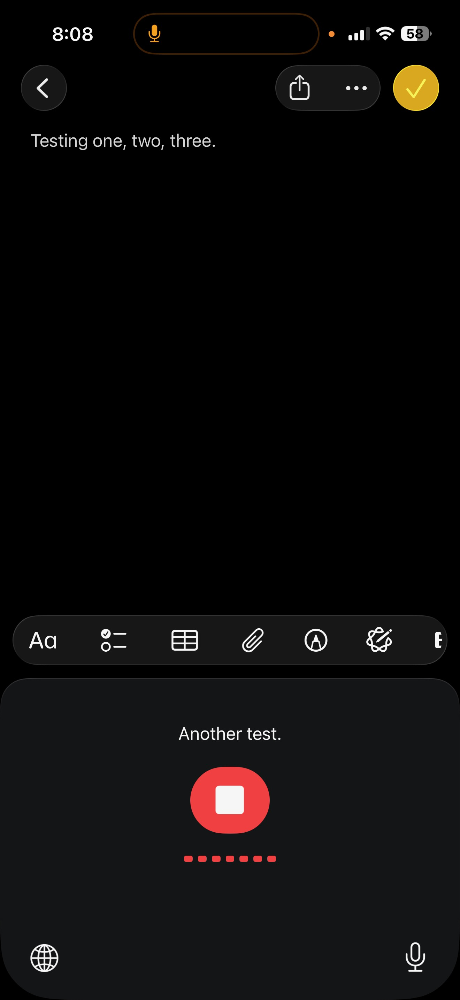
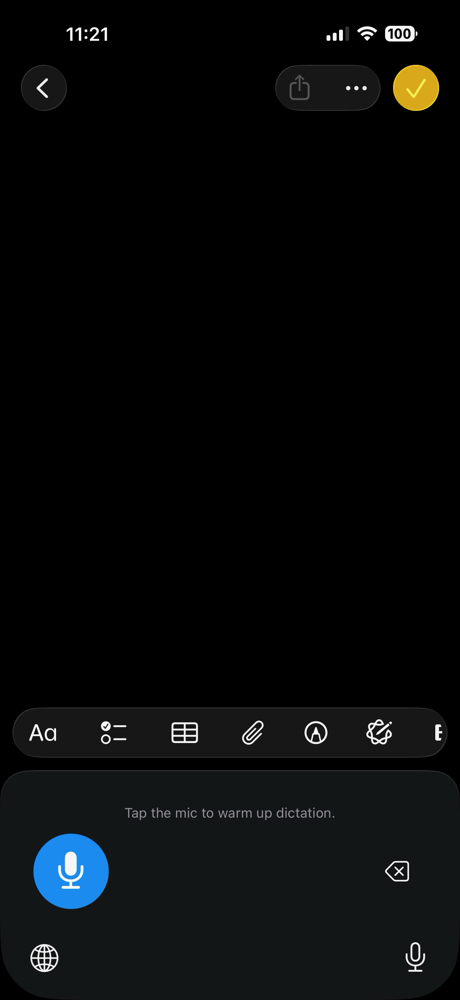
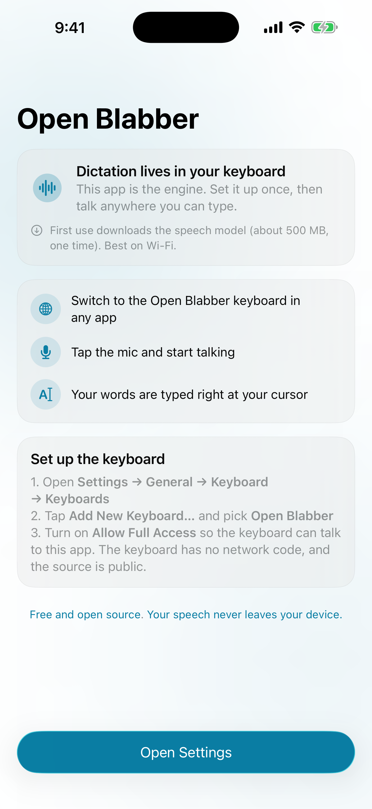

  

<h1 align="center">Open Blabber</h1>

  A free, open-source English dictation keyboard for iPhone and iPad. 
  Speak anywhere you can type. Transcribed live, entirely on your device.

  
  
  
  

  <a href="https://openblabber.com"><b>openblabber.com</b></a> ·
  <a href="https://openblabber.com/#privacy">Privacy Policy</a> ·
  <a href="https://openblabber.com/#terms">Terms</a>

  
  &nbsp;
  
  &nbsp;
  

## What it is

- **Private by design.** Your voice, transcripts, and typed text never leave your phone. No Open Blabber servers, accounts, analytics, or ads. The English speech model ships inside the app, so transcription needs no server or runtime model download.
- **Fast, focused English dictation.** [Moonshine Tiny Streaming](https://github.com/moonshine-ai/moonshine) is built for live speech recognition. Its compact, quantized English model produces revisable partial text as you talk instead of repeatedly transcribing the entire recording.
- **Small and auditable.** A focused Swift codebase uses the open-source [Moonshine Voice](https://github.com/moonshine-ai/moonshine-swift) package (MIT). The companion app owns audio and inference; the memory-constrained keyboard owns only its UI and protected local hand-off.

## How it works

iOS does not let custom keyboard extensions record audio ([Custom Keyboard documentation](https://developer.apple.com/library/archive/documentation/General/Conceptual/ExtensibilityPG/CustomKeyboard.html)). Open Blabber therefore keeps the microphone and speech model in its companion app, while the keyboard extension remains small:

1. Enable the keyboard in **Settings → General → Keyboard → Keyboards → Add New Keyboard → Open Blabber**, then turn on **Allow Full Access**.
2. In any app, switch to the Open Blabber keyboard and tap its center button. If needed, the keyboard opens Open Blabber, which prepares the local model and then starts the microphone automatically. Use iOS’s Back control to return to the app you were using.
3. Tap the center mic, talk, and tap the same button to stop. Live recognized text and a voice-activity animation appear while you speak. The result is inserted automatically when you are still in the same text field; otherwise the same center button offers a safe manual insert.

Under the hood: the companion app keeps the microphone available during the brief app-to-keyboard handoff and while the Open Blabber keyboard remains present (`UIBackgroundModes: audio`). Leaving or switching the keyboard sends an immediate shutdown; a three-second heartbeat watchdog handles extension termination where lifecycle callbacks never arrive. Shutdown releases the microphone, cancels transcription, wipes temporary results, and unloads the model. Audio begins flowing to Moonshine only after you tap the center mic, is processed as short memory-only chunks, is capped at two minutes, and is never written to disk. Open Blabber does not retain a second recording buffer. The keyboard receives only bounded text and a normalized activity level—never PCM or model objects.

### Why "Allow Full Access"?

Full Access lets the keyboard participate in the protected, device-local App Group coordination and receive temporary live and final text produced by the companion app. The keyboard extension itself contains no microphone capture, speech model, or networking code. On current iOS releases, Full Access can also affect whether a keyboard can open its companion app; if that launch is unavailable, open Open Blabber manually. For safe insertion, the keyboard briefly fingerprints a small amount of immediately surrounding cursor/selection context. It never writes or retains that context.

### Where's the ML model?

The seven quantized Moonshine Tiny Streaming English model assets—roughly 49 MB total—are bundled directly in Open Blabber. There is no first-run model download: transcription is offline from the first launch. The companion app loads the model before activating the microphone and does not buffer audio until you tap the center mic. The keyboard target does not contain or link the model.

## Repo layout

| Path | What it is |
|---|---|
| `App/OpenBlabberApp.swift` | Companion-app UI, microphone lifecycle, and streaming audio handoff |
| `App/MoonshineRecognizer.swift` | App-only, bounded-queue adapter for local Moonshine streaming transcription |
| `App/MoonshineModels/tiny-streaming-en/` | Bundled quantized English model assets and their MIT license |
| `App/SharedIPC.swift` | App-side copy of the versioned shared mailbox protocol |
| `Keyboard/KeyboardViewController.swift` | Lightweight one-button keyboard UI, live feedback, result routing, and text insertion |
| `Keyboard/SharedIPC.swift` | Keyboard-side copy of the versioned shared mailbox protocol, with no app/model dependency |
| `App/PrivacyInfo.xcprivacy`, `Keyboard/PrivacyInfo.xcprivacy` | Privacy manifests for the two targets |
| `Tests/` | Focused protocol, expiry, routing, lifecycle, live-feedback, and buffer tests |
| `site/index.html` | The website (privacy policy and terms), deployable to any static host |
| `screenshots/` | App Store and README screenshots |

## Building

Open `OpenBlabber.xcodeproj` in Xcode 16.3 or later, set your development team on both targets, and run the shared **OpenBlabber** scheme on a device running iOS 17+. Xcode fetches the pinned Moonshine Voice package automatically; the seven Tiny Streaming model files are app resources rather than keyboard resources.

The two targets share an App Group (`group.com.openblabber.app`). If you build under your own team with different bundle IDs, update the App Group in both `.entitlements` files and in the two `SharedIPC.swift` copies.

The shared scheme and committed `Package.resolved` mean the project is ready for CI, including Xcode Cloud: archive the **OpenBlabber** scheme in Release and distribute to TestFlight.

## Supported languages

**English only.** This is deliberate: Open Blabber uses Moonshine's compact English streaming model so every byte and compute cycle can focus on making private English dictation smaller, faster, and more efficient instead of carrying a much larger multilingual model. It does not perform language detection or translation.

## Honest trade-offs

- iOS shows its orange privacy indicator while the companion app keeps the microphone available. Switching away from or dismissing the Open Blabber keyboard shuts it down and unloads the model.
- iOS provides no public API for returning automatically to an arbitrary previous app. The system’s Back control or app switcher is required after Open Blabber opens.
- Current iOS keyboard restrictions can prevent the extension from opening its companion app when Full Access is off. In that case, open Open Blabber yourself.
- Open Blabber transcribes English only. The bundled model adds roughly 49 MB to the app download, but avoids a separate first-run model download.

## Contributing

Issues and pull requests are welcome. Keep the spirit of the project: minimal, auditable, dependency-light, private. By contributing, you additionally grant the project maintainer permission to distribute your contribution on the Apple App Store (an [additional permission under GPLv3 section 7](https://www.gnu.org/licenses/gpl-faq.html#GPLIncompatibleLibs), needed because App Store terms are otherwise incompatible with the GPL).

## Support the project

Open Blabber is free and always will be. If it saves you time, you can say thanks by starring the repo or [buying me a coffee](https://buymeacoffee.com/bchip).

Also by the maker: [OpenFret](https://openfret.com), a free platform for guitarists.

## License

[GPLv3](LICENSE). You're free to inspect, modify, and redistribute Open Blabber, but if you distribute a derivative, its source code must be open under the same terms. Moonshine Voice and the bundled Moonshine English model are available under the [MIT license](App/MoonshineModels/tiny-streaming-en/LICENSE).
