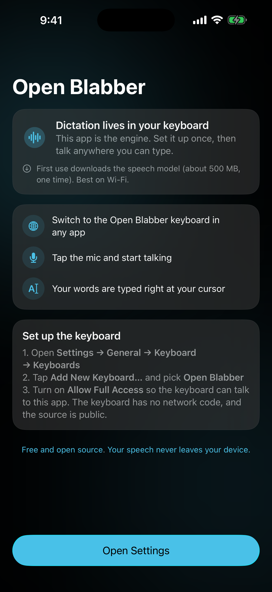

  

<h1 align="center">Open Blabber</h1>

  A free, open-source English dictation keyboard for iPhone and iPad. 
  Speak anywhere you can type. Open Blabber transcribes live on your device.

  
  
  
  

  <a href="https://openblabber.com"><b>openblabber.com</b></a> ·
  <a href="https://openblabber.com/#privacy">Privacy Policy</a> ·
  <a href="https://openblabber.com/#terms">Terms</a>

  
  &nbsp;
  
  &nbsp;
  

## What it is

Everything involved in transcription stays on the phone. Open Blabber does not use accounts, analytics, or ads. The English model ships with the app, so there is nothing else to download before the first dictation. Once text is inserted, the app you are typing in decides what happens to it.

Open Blabber uses [Moonshine Tiny Streaming](https://github.com/moonshine-ai/moonshine) for live English recognition. The compact, quantized model updates partial text while you speak instead of rerunning transcription over the full recording.

The companion app handles audio and inference through the open-source [Moonshine Voice](https://github.com/moonshine-ai/moonshine-swift) package (MIT). The keyboard handles its interface, text insertion, and the protected local handoff.

## Why the app and keyboard are separate

One way to keep a voice keyboard small is to send speech to a transcription service. Open Blabber runs that work on the phone instead. Audio is never uploaded, so the keyboard and companion app have to divide the work.

Apple does not allow custom keyboard extensions to use the microphone, even with Full Access. Extensions also have tight memory limits that vary by device and iOS version. Open Blabber's seven model files total about 49 MiB (51 MB) before inference working memory, so the companion app loads them.

The app owns the microphone, model, and transcription session. The keyboard sends commands and receives control state, bounded text, progress, and normalized voice activity through protected App Group files. It never receives PCM or model objects.

Open Blabber supports English only because another Moonshine language would require another model or a broader replacement. Tiny Streaming takes less storage than Moonshine's larger English models, but it gives up some accuracy on difficult speech. The model still updates text while you talk.

## How it works

Apple's [Custom Keyboard documentation](https://developer.apple.com/library/archive/documentation/General/Conceptual/ExtensibilityPG/CustomKeyboard.html) explains the microphone restriction. Setup and dictation work like this:

1. Enable the keyboard in **Settings → General → Keyboard → Keyboards → Add New Keyboard → Open Blabber**, then turn on **Allow Full Access**.
2. In any app, switch to the Open Blabber keyboard and tap its center button. If needed, the keyboard opens Open Blabber, which prepares the local model and then starts the microphone automatically. Use iOS's Back control to return to the app you were using.
3. Tap the center mic, talk, and tap the same button to stop. Live recognized text and a voice-activity animation appear while you speak. The result is inserted automatically when you are still in the same text field; otherwise the same center button offers a safe manual insert.

The companion app keeps the microphone available during the handoff and while the Open Blabber keyboard remains present, using `UIBackgroundModes: audio`. Leaving or switching keyboards asks the app to shut down immediately. If iOS skips the lifecycle callback, a stale heartbeat triggers cleanup after about three seconds. Cleanup releases the microphone, cancels transcription, deletes temporary results, and unloads the model.

Audio reaches Moonshine only after you tap the center mic. The app processes it in bounded chunks in memory, never writes it to disk, and never saves a complete recording. Each dictation stops after two minutes.

The keyboard receives control state, bounded text, progress, and normalized activity. It never receives PCM or model objects.

### Why "Allow Full Access"?

Open Blabber needs Full Access because the keyboard must write commands, liveness messages, and result receipts to the shared App Group. Full Access also permits network access, but the keyboard contains no networking code and the transcription path makes no network requests. It does not give the keyboard microphone access.

iOS may refuse a request to open the companion app. If that happens, open Open Blabber manually.

Before inserting text, the keyboard fingerprints a small amount of context around the cursor and selection to confirm that the field has not changed. It keeps the fingerprint in memory and does not store the source text.

### Where's the ML model?

Open Blabber bundles seven quantized Moonshine Tiny Streaming English model files. Together, the raw files take about 49 MiB (51 MB). There is no first-run model download, so transcription works offline from the first launch. The companion app loads the model before activating the microphone and does not buffer audio until you tap the center mic. The keyboard target neither contains nor links the model.

## Repo layout

| Path | What it is |
|---|---|
| `App/OpenBlabberApp.swift` | Companion-app UI, microphone lifecycle, and streaming audio handoff |
| `App/MoonshineRecognizer.swift` | App-only, bounded-queue adapter for local Moonshine streaming transcription |
| `App/MoonshineModels/tiny-streaming-en/` | Bundled quantized English model assets and their MIT license |
| `App/SharedIPC.swift` | App-side copy of the versioned shared mailbox protocol |
| `Keyboard/KeyboardViewController.swift` | Lightweight one-button keyboard UI, live feedback, result routing, and text insertion |
| `Keyboard/SharedIPC.swift` | Keyboard-side copy of the versioned shared mailbox protocol, with no app/model dependency |
| `App/PrivacyInfo.xcprivacy`, `Keyboard/PrivacyInfo.xcprivacy` | Privacy manifests for the two targets |
| `Tests/` | Focused protocol, expiry, routing, lifecycle, live-feedback, and buffer tests |
| `site/index.html` | The website (privacy policy and terms), deployable to any static host |
| `screenshots/` | App Store and README screenshots |

## Building

Open `OpenBlabber.xcodeproj` in Xcode 16.3 or later, set your development team on both targets, and run the shared **OpenBlabber** scheme on a device with iOS 17 or later. Xcode fetches the pinned Moonshine Voice package. The seven model files are app resources and are never added to the keyboard target.

The two targets share an App Group (`group.com.openblabber.app`). If you build under your own team with different bundle IDs, update the App Group in both `.entitlements` files and in the two `SharedIPC.swift` copies.

CI services, including Xcode Cloud, can archive the shared **OpenBlabber** scheme using the committed `Package.resolved`. Use a Release archive when distributing through TestFlight.

## Supported languages

Open Blabber supports English only. Supporting another Moonshine language would require more model files or a broader replacement, which would increase the app's size. The app does not detect languages or translate speech.

## Limitations

- The first dictation may open the companion app while it prepares the model and microphone. iOS has no public API for returning automatically to an arbitrary previous app, and it may refuse the launch request. Use the system Back control or app switcher, or open Open Blabber manually.
- iOS displays its orange microphone indicator during the handoff and active keyboard session. Leaving or switching keyboards asks the app to shut down, with a heartbeat timeout as a fallback when iOS misses the callback.
- The keyboard provides dictation, deletion, and keyboard switching. Use another keyboard for letter-by-letter typing.
- Names and specialist terms are common trouble spots for the compact model. Noise, overlapping voices, and unclear speech also reduce accuracy. Partial text may change as you speak, so review important text before sending it.
- A dictation session stops after two minutes. Interruptions, memory pressure, or system termination can stop it sooner. Local inference uses memory, processing time, and battery. Those costs have not yet been benchmarked across supported iPhones.
- Full Access lets the keyboard write to the protected shared container and also permits network access. Open Blabber does not use that network capability for transcription, analytics, or advertising.

## Contributing

Issues and pull requests are welcome. Please keep changes easy to audit and avoid dependencies without a clear reason. Privacy-sensitive behavior should remain visible in the code.

By contributing, you grant the project maintainer permission to distribute your contribution through the Apple App Store. This is an [additional permission under GPLv3 section 7](https://www.gnu.org/licenses/gpl-faq.html#GPLIncompatibleLibs) because the App Store terms otherwise conflict with GPLv3.

## Support the project

Open Blabber is free and will stay that way. If it saves you time, star the repository or [buy me a coffee](https://buymeacoffee.com/bchip).

I also make [OpenFret](https://openfret.com), a free set of tools for guitarists.

## License

[GPLv3](LICENSE). You're free to inspect, modify, and redistribute Open Blabber, but if you distribute a derivative, its source code must be open under the same terms. Moonshine Voice and the bundled Moonshine English model are available under the [MIT license](App/MoonshineModels/tiny-streaming-en/LICENSE).
